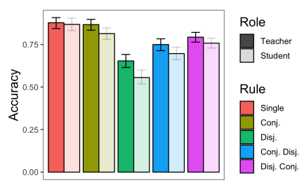
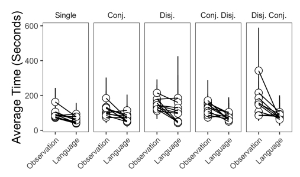
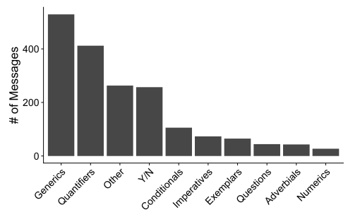

This Monday, I presented three papers to my lab at MIT that I think are pioneering a unique, promising and 
under-explored approach to the study of intelligence: __the cultural ratchet__. This is the direction I'll be working
on with [Noah Goodman](https://cocolab.stanford.edu/ndg) during my first rotation at Stanford, so I'm very
excited to share what this idea is and why I think it's so important.

## Background

I was introduced to the idea of the cultural ratchet at ICLR 2019 when I chanced upon
Noah Goodman's talk:

<iframe width="560" height="315" src="https://www.youtube.com/embed/72DtZm9OrH0" title="YouTube video player" frameborder="0" allow="accelerometer; autoplay; clipboard-write; encrypted-media; gyroscope; picture-in-picture" allowfullscreen></iframe>

For those who don't have time to watch the video, Noah starts by asking: how is it possible that 
baby humans transition from knowing basically nothing to building rocket ships and Twitter
in two decades, whereas baby monkeys start in the same place but grow up to fling shit? Nearly all of modern
machine learning seems obsessed with scaling up algorithms, agents or architectures to take
advantage of (1) higher dimensional data and (2) orders of magnitude more data, but Noah points out,
this isn't how humans make it past ape intelligence.

The way we make it past ape intelligence is via something called the cultural ratchet. The motivating
observation is that in general, inference is intractable; consequently, if each human tried to learn
(probabilistic) truths about the world in their limited lifespan, they are bound to fail. However, 
our species has two properties. First, even if most humans learn nothing, die young or are generally
stupid, there exists a small subset of individuals that over the course of their lives learn one new
insight about the world. Second, our species is equipped with a tool, language, that allows one individual
to pass on conceptual knowledge to the rest of the species in a manner that is (a) comparably accurate
to learning the concept directly from experience and (b) takes less time than learning the concept
directly from experience. If you buy that our species has these two properties, then the implication
is that knowledge accumulates across generations, accelerating individuals' otherwise limited learning,
ratcheting up and up, propelling the human baby to master calculus and software engineering and 
aerospace engineering faster than any previous generation.

While this hypothesis for intelligence seems obviously true (at least to me), the details
of how exactly language plays the role of the ratchet need to be uncovered. The following three
papers are relatively recent projects that study concept learning via language in humans.

## Chopra, Tessler, Goodman (2019)

In this paper, the authors aimed to specifically study how language enables the (a) accurate and (b) efficient
transmission of conceptual knowledge? This paper compares paired humans as one learns a novel
boolean concept via examples and then teaches the other the boolean concept via language.

### Setup

Two humans are paired together. In the concept learning phase, one human (the teacher) learns
a Boolean concept from examples. In the concept communicating phase, the teacher explains
the concept to the other human (the student). In the concept testing phase, both
participants were shown the same grid of held-out samples. Participants were then shown their
own score and their partner's score.

Concepts were generated by 5 different rules: single features, conjunction, disjunction, conjunctive
disjunction, disjunctive conjunction. Each pair went through 5 rounds, where each round had a new
concept created with a new rule. Teachers learned the rule through clicking on 6 examples, each of
which were labeled with "concept" or "not concept."

### Results

- How accurate is learning from language, relative to learning from examples? Answer: comparable.
  The average difference in accuracy is 5.3% (95% credible interval: 2.7%-8.2%).

- The difference between student and teacher performance depends on the particular rule to communicate,
  with harder rules being more difficult to transmit

- What effect does the quality of the teacher (measured by accuracy) have on the student (also measured
  by accuracy)? The two are decently correlated (r = 0.60, p < 0.001)

- Additionally, students tend to make the same mistakes as their teachers (which can be quantified because
  the test data is the same for the teacher and student). Null hypothesis is computed using permutations of
  teacher-student pairs: Hamming edit distance is 11.1 for true student-teacher pairs, but 13.53 for permuted
  student-teacher pairs. The plot below is from the concept testing phase. The "Average Hamming Distance"
  is how much the student's choices differ from the teacher's choices.

- How efficient is learning time for observations versus language? Can quantify how much time the teacher
  spent in concept learning phase versus how much time the student spent in concept communicating phase.
  Learning time is typically faster for language learning than observation learning, with a parameter -0.64
  (95% credible interval: -0.82, -0.48) seconds

- What properties of language enable the efficient and accurate transmission of knowledge? Coding message
  types shows that generics and quantifies dominated:

### Comments

- The authors don't dissect how particular language choices influence the accuracy or efficiency of knowledge
  transmission
- It's also difficult to imagine what other language choices are possible for transmitting these sorts of concepts
  through the message interface
- None of the concepts are probabilistic; they're all deterministically true or false
