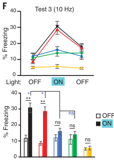
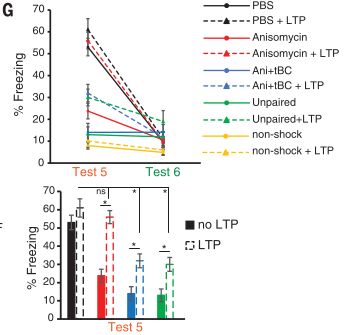
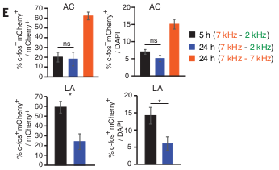

## Research Questions

Previously, [Rashid et al. 2016](../_kernel_papers_drafts/rashid_science_2016_competition_memory_engrams.md)
and [Cai et al. 2016](../_kernel_papers_drafts/cai_nature_2016_shared_memory_engrams.md) showed that conditioning
close in time result in overlapping engrams, and [Yokose et al. 2017](yokose_science_2017_overlapping_memory_engrams.md)
further showed that the overlap in neurons between engrams is responsible for linking the 
shared experiences. This paper asks and answers:

- How does the brain distinguish identity of particular memory amid many
memories in the same ensemble? Answer: sensory engrams drive reactivation of the entangled
  engram
  

## Experiments

### Exp 1

- There are a lot of details here!
- Previous results showed plasticity between auditory cortex (AC), medial
  geniculate nucleus (MGn) and lateral amygdala (LA) is necessary for auditory fear conditioning
- Day 1-2: Auditory cue (2 kHz)
- Day 4: Fear conditioning (7 kHz)
- Day 5: Test fear recall. Immediately after, mice injected with one of: saline (PBS), anisomycin (ani), 
  anisomycin + tat-beclin (Ani+tBC)

  

- Test 2: Ani resulted in partial retrograde amnesia; Ani+tBC resulted in complete retrograde amnesia (1E)
- Optogenetic activation of AC and MGn engram neurons with axons in LA induced fear recall in
 PBS and Ani gropus, but not Ani + tBC (consistent with prior results) (1F)

- Day 7: Try recovering AC & MGn synapses to LA with optogenetic stimulation
- Test 3: Ani group recovered to baseline (1G, left) whereas Ani+tBC did not (1G, left) 

- Day 38-39 (test 7 & 8): Test fear retrieval. Ani + tBC remained low, comparable to unconditioned

- Day 40 (test 9): Test fear retrieval with optogenetic stimulation. Ani + tBC + LTP on day 8
recovers association, but Ani + tBC does not.
- Same result if recall was tested using optogenetic activation instead of tone
- Takeaway: Ani + tBC prevents AC and MGn synapses from activating LA engram 

### Exp 2
- Don't understand. Something about selective erasure of target memory.

### Exp 3
- Don't understand. Something about selective erasure of target memory.

### Exp 4
- What is effect of complete retrograde amnesia of one memory in shared engram ensemble?
- Fear condition 7-kHz (event 1). Then fear condition 2-kHz (event 2)
  either 5 hours or 24 hours later
  

- When two events were separated by 5 hours, recall for event 2 was enhanced (fig. S5),
consistent with Rashid 2016
  
- Regardless of 5h or 24h, two engrams were found in auditory cortex (3E top)

- Overlap in lateral amygdala was significantly larger in 5h than 24h

  
### Exp 5

- Building off previous experiment, have two groups of mice go through
  two fear conditionings separated by 5 hours
- Group 1 has AC/MGn injected with saline after Event 1 test (Day 5), 
  then AC/MGn injected with Ani+tBC after Event 2 test (Day 7)
- Group 2 has AC/MGn injected with Ani+tBC after Event 1 test (Day 5),
  then AC/MGn injected with saline after Event 2 test (Day 7)

- Both groups correctly recall fear during first test to Tone A
- Group 1 unaffected during second test of Tone A, but Group 2 freezes significantly
less (suggesting erasure of Fear 1)
- Both groups correctly recall fear during first test to Tone B
- Group 2 unafffected during second test of Tone B, but Group 1
freezes significantly less (suggesting erasure of Fear 2)

- Cartoon demonstrating selective erasure of synapses to shared engram.
Yellow are two overlapping engrams in lateral amygdala

- Takeway: we can selectively erase synapses from sensory areas (auditory cortex, MGn)
  to lateral amygdala
- Rylan question: how do we know that Tone A fear is preserved in group 2?

### Exp 6

- How is each memory preserved in the shared ensemble?
- Takeaway: sensory-engrams drive overlapping engrams, preserving uniqueness of memory

TODO: maybe finish later. this was a big let down