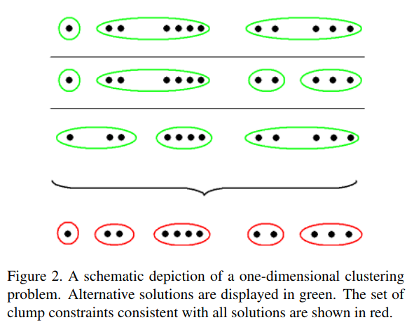

## Research Questions

- How to perform online/streaming inference in Dirichlet process mixture model? 

## Conceptual Notes

- Problem: Enumerating & updating all possible partitions (hypothesized clusters)
  requires superexponential time and space
  
- Idea:
    - Combine many clustering hypotheses into single set of constraints
    - For instance, if in every hypothesized partition, observations 1 and 2
    are always grouped, then "clump" 1 and 2 together
    - each datapoint belongs to exactly 1 clump
    - the set of clumps is the partition with the fewest number of sets that
    can be unioned to construct every possible clustering hypothesis
    - Below, the first three rows are each one possible hypothesized partition. The
      final row are the clumps that can be used to construct every hypothesized partition 

      

- Challenge: In theory, all partitions are valid hypotheses (although
  some partitions are more likely than others). Why prevents each clumps from
  containing exactly one point?
  - Answer: __Unanswered__. One relevant answer is they hard assign each data point
  to one cluster (equation 10) similarly to the Local MAP approximation:
    
  $$\argmax_k q(z_s = k) $$

- Challenge: How do we extract clump constraints without explicitly computing
all hypothesized partitions?
  - Answer: Hypothesized partitions have redundancy in that they likely differ from each
  other only for a subset of points. "Our approach is to partition the clustering problem"
    into a series of independent subproblems [...] This forms a tree of possible groupings
    of data and the bottom level of this tree defines our clump constraints." __I don't 
    understand this__. For instance, in the below example, the tree seems to presume that
    all hypotheses can be split between the left 7 points and the right 5 points; what
    if no such cut exists?
    

- Challenge: Relatedly, if not all partitions are valid hypotheses, then what how
  do we ensure unions of clumps yield a valid hypothesis? For instance,
  suppose we have clumps {1, 2}, {3}, {4} that arise from hypothesis
  {1, 2, 3}, {4} and hypothesis {1, 2, 4} {3}. But hypothesis {1, 2, 3, 4} is
  not a valid hypothesis.
  - Answer: __Unanswered__
  
- Challenge: The space of hypotheses, constructed from clump unions,
  is still combinatorically large. Do we actually get a benefit?
  
  
## Algorithm Specifics

The algorithm is called the Memory Bound Variational Dirichlet Process (MB-VDP).

- Draw data in batches (called epochs) of size E data points
  - Compute best estimated mixture model using [Blei and Jordan (2006)](blei_bayesian_analysis_2006_variational_dirichlet_mixtures.md)
    truncated variational Bayes model
      - Use a modified version from Kurihara 2007 that starts with one component
    and splits so long as ELBO / free energy increases
      - Perform variational optimization subject to clump constraints (how this constraint
        is imposed in the optimization is not clear)
  - Compression phase: compute clump constraints in top-down manner
      - Data points in same clump are used to update clump sufficient statistics
      - Unless too few points are in a clump to compute sufficient statistics (e.g. covariance).
        In this case, we save the individual data points (termed singlets)
      - Stop when too much time / space (number of clump constraints) used