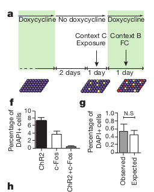
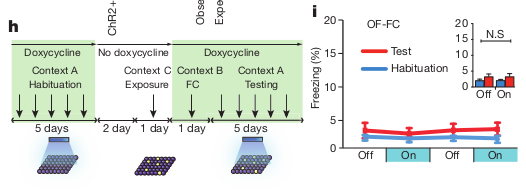

## Background

Previously, ablating/inactivating memory engram neurons prevented
retrieval of fear response

c-fos is an immediate early gene often used as marker of recent neuronal
  activity

## Research Questions

- Does activating memory engram neurons invoke a retrieval of fear response?

## Experiments

### Exp 1 (Cellular)

- 

### Exp 2 (Neural, Behavioral)

- Experimental (Exp): 5 days habituation in Context A. Fear conditioning in context B (tone+shock).
- Optogenetically activate Context B neurons when mouse back in Context A (Fig 3A)
- No shock (NS): same as experimental group, but no shock in context B.
- Optogenetic activation had no effect on freezing response (Fig 3B)
- EYFP: same as experimental group, but no optogenetic activation in Context A (Fig 3C)

- Freezing by experimental group is relatively small. Authors hypothesized this might
be due to imprecision with tagging engram neurons
- Authors added two more groups
- Exp 1-Day: shortened DOX-off period from 2 days to 1 day (allowing for better
  targeting of active cells during fear conditioning), showed higher freezing (Fig 3D)
- Exp-Bi: Exp used unilateral injection of virus and optogenetic stimulation. Now use bilateral
 intervention. (Fig 3E)
- Takeaway: optogenetically activating engram neurons, not other neurons, induces fear recall

### Exp 3 (Neural)
- Is the previous result context specific?
- First test whether different contexts activate same dentate gyrus (DG) cells
- Take mice off DOX, place in context C, then place back on DOX, fear condition in Context B
and kill mice 1.5hr later
  - ChR2–EYFP used to identify Context C cells and c-fos used to identify Context B cells
  - Overlap at chance levels (Fig 4G)

### Exp 4 (Neural, Behavioral)
- Having established that contexts are assigned to different DG populations, now test whether
activating non-fear context invokes fear response
- Repeat previous experiment, adding fear conditioning before killing the mice. Then 
  optogenetically activate the (neutral) Context C. Freezing at habituation levels

- Takeaway: activating other engram cells does not invoke freezing response