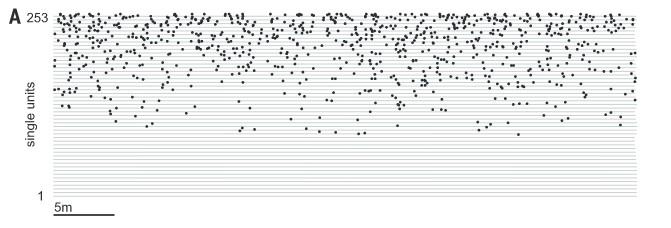
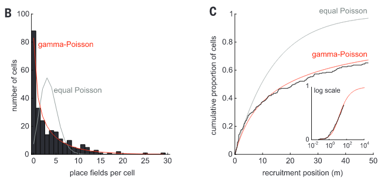
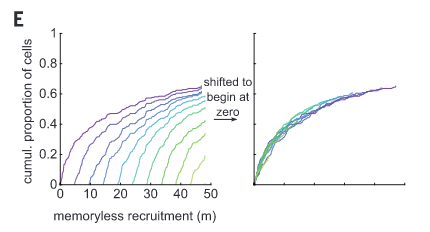

## Research Questions

Where are place fields created in new environments?

## Experiments

### Exp 1

Record 253 pyramidal cells from dorsal CA1 on progressively extended track
from 3m to 10m to 22m to finallly 48m. Only analyzed neurons that could be 
isolated in sleep periods flanking experimental sessions.

Modelled field
placement per neuron as Poisson process (locations i.i.d., with some fixed
rate per neuron); excellent fit for neurons with 6 or more fields. Then
asked whether population could also be modeled by something simple. Using
Poisson again didn't work because variance > mean (overdispersed), prompting
consideration of a negative binomial model, which can be seen as an infinite
mixture of Poisson distributions with different rates. This NB model fit
best with parameters $$r= 0.57, p = 0.14$$.

Can calculate "recruitment curves" by asking what cumulative fraction
of neurons are participating from a given starting point (left). The
recruitment curves were identical as a function of distance from
starting location (right). 

