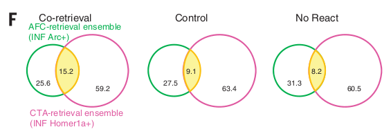
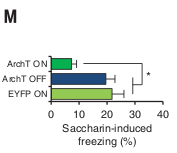
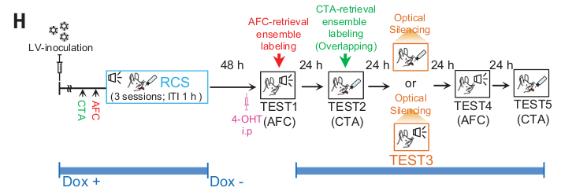
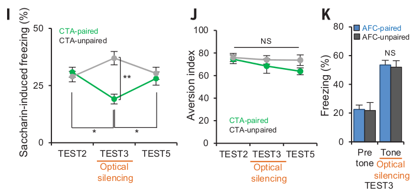

## Research Questions

Previous work ([Rashid et al. 2016 (Science)](rashid_science_2016_competition_memory_engrams.md),
[Cai et al. 2016 (Nature)](cai_science_2016_shared_memory_engrams.md)) showed that conditioning
two unrelated conditioned stimuli (CSes) close in time would result in an overlapping memory engram.

- If two fear conditionings use separate modalities (here, taste and tone), can we entangle the memories
 through repeat co-exposure? Answer: yes.
- What is the neural basis of the entangled memories? The two engrams have overlapping neurons.
- Are the overlapping neurons necessary to retrieve either memory separately? No.
- Are the overlapping neurons necessary to retrieve the linked memory? Yes.

"Memory traces for two independent 
emotional memories in the brain partially overlapped when the two memories were retrieved 
synchronously to create a linkage. Suppressing the activity of the overlapping memory
trace interrupted the linkage without damaging the original memories."

## Experiments

### Exp 1 (Behavior)

- Mice trained conditioned taste aversion (CTA) Days 5-6, then auditory fear conditioning (AFC) on Day 10.
- On Day 11, some mice had CS1 (taste) and CS2 (tone) paired during repeated coretrieval sessions (RCS)
- Control mice did not hear tone during retrieval sessions

- During subsequent CTA test, mice froze, indicating taste had become linked to fear of tone-predicting shock
- During subsequent CTA test, control mice froze less
- Takeaway: Co-presenting stimuli links two already-formed memory engrams

### Exp 2 (Behavioral & Neuralg)

- Perform conditioned taste aversion (CTA) and auditory fear conditioning (AFC). I could not find
  the spacing between these two conditioning events in the paper or in the supplement.
- Inject protein synthesis inhibitor anisomycin (or vehicle, control)
  after Test 1 (day 12)

  

- Anisomycin disrupted CTA aversion 24 hours later (H) and AFC aversion 48 hours later (I)

- For control group that wasn't presented with CTA and AFC simultaneously, anisomycin impaired
CTA retrieval 24 hours later (J) but did not affect AFC aversion 48 hours later (K)

- Percentage of the coshared neuronal population in amygdala between CTA and AFC
  to total ensembles activated during retrieval was 15.2% (coretrieval), 9.1% (control), 
  and 8.2% (no-reactivation).

- Takeaway: Impairing one engram only affects the other engram if the two engrams have been linked
  by co-presentation of the taste and tone stimuli
  
### Exp 3 (Neural)

- Optogenetically suppress AFC neurons during repeated coretrieval sessions

  

- Optical silencing of AFC engram during repeated coretrieval sessions had no effect on retrieval
  of the original CTA and AFC memories

- Optical silencing of AFC engram during repeated coretrieval sessions prevented freezing in
response to CTA (animal was no longer terrified of bitter water)

- Ratio of overlapping cells was significantly reduced by optical silencing
- Takeaway: Optogenetic silencing of one engram while the other is acquired prevents
the two engrams from becoming linked

### Exp 4 (Neural)

- Don't understand

### Exp 5 (Neural)

- Test whether overlapping neurons cause taste-induced freezing by silencing
only overlapping neurons

- Two groups were subjected to the CTA retrieval test with or without
  optical silencing (CTA-paired or CTA-unpaired,
  respectively)
  
- Two other groups were subjected to the AFC retrieval test
  with or without optical silencing (AFC-paired or AFC-unpaired,
  respectively).

- CTA aversion unaffected by silencing overlapping neurons (J)
- AFC freezing unaffected by silencing overlapping neurons (K)
- Silencing overlapping neurons significantly reduced taste-induced freezing(I)

- Takeaway: overlapping neurons link one engram (shock and freezing) to another engram
  (taste). Silencing overlap doesn't impair either separate memory, but does impair link
