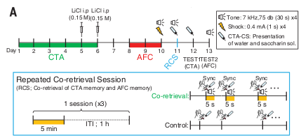
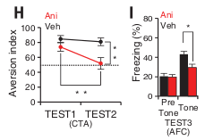

## Background

Previous work ([Rashid et al. 2016 (Science)](rashid_science_2016_competition_memory_engrams.md),
[Cai et al. 2016 (Nature)](cai_science_2016_shared_memory_engrams.md)) showed that conditioning
two unrelated conditioned stimuli (CSes) close in time would result in an overlapping memory engram. 

__Disclaimer__: I found this paper very hard to read. 

## Research Questions

"If one retrieves two memories around the same time, a small number of neurons will 
become involved in both memories. Yokose et al. investigated the cellular ensemble 
mechanisms underlying the association between two such memories. In mice, a small 
population of neurons mediates the association. Memory traces for two independent 
emotional memories in the brain partially overlapped when the two memories were retrieved 
synchronously to create a linkage. Suppressing the activity of the overlapping memory
trace interrupted the linkage without damaging the original memories."

## Experiments

### Exp 1 (Behavior)

- Mice trained conditioned taste aversion (CTA) Days 5-6, then auditory fear conditioning (AFC) on Day 10.
- On Day 11, some mice had CS1 (taste) and CS2 (tone) paired during repeated coretrieval sessions (RCS)
- Control mice did not hear tone during retrieval sessions

- During subsequent CTA test, mice froze, indicating taste had become linked to fear of tone-predicting shock
- During subsequent CTA test, control mice froze less
- Takeaway: Co-presenting stimuli links two already-formed memory engrams

### Exp 2 (Behavioral & Neuralg)

- Perform conditioned taste aversion (CTA) and auditory fear conditioning (AFC). I could not find
  the spacing between these two conditioning events in the paper or in the supplement.
- Inject protein synthesis inhibitor anisomycin (or vehicle, control)
  after Test 1 (day 12)

  

- Anisomycin disrupted CTA aversion 24 hours later (H) and AFC aversion 48 hours later (I)

- For control group that wasn't presented with CTA and AFC simultaneously, anisomycin impaired
CTA retrieval 24 hours later (J) but did not affect AFC aversion 48 hours later (K)

- Takeaway: Impairing one engram only affects the other engram if the two engrams have been linked
  by co-presentation of the taste and tone stimuli
  
### Exp 

