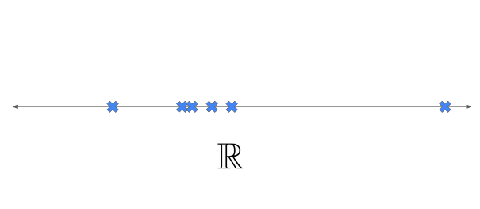

# Leverage (Statistics)

Leverage describes the influence a particular datum has over the linear parameters
when fitting a linear regression model. 

## Intuition

Suppose we will fit a linear model to predict $$y$$ using $$x$$,
where $$x \in \mathbb{R}$$. Before even seeing the target $$y$$ values,
looking at the below data, which datum will likely have the greatest influence
over the line of best fit?

Intuitively, the datum furthest to the right. If its corresponding target is
a large positive number, the line will probably slope up, whereas if its
corresponding target is a large negative number, the line will probably slope down.

## Hat Matrix

We know that the optimal parameters will be given by

$$ \beta := (X^T X)^{-1} X^T Y$$

and thus the predictions will be given by

$$ \hat{Y} := X \beta = X (X^T X)^{-1} X^T Y$$

The number of data by number of data matrix $$H := X (X^T X)^{-1} X^T$$ is called the hat
matrix because it places a hat on $$Y$$. The leverages of each datum are given by the diagonal
elements of the hat matrix.

### Dual Form

The previous definition of the hat matrix $$H := X (X^T X)^{-1} X^T$$ is sometimes
called the primal form. By the Push-Through Identity, the hat matrix can also be 
written in the dual form $$H := X X^T (X X^T)^{-1}$$

## Properties

Let $$h_i := [H]_{ii}$$ be the leverage score of the $$i$$th datum.

- $$H = H^2$$ i.e. $$H$$ is idempotent. Proof: We know that $$H^2 = H H = X (X^T X)^{-1} X^T X (X^T X)^{-1} X^T = H$$.

- $$H = H^T$$ i.e. $$H$$ is symmetric.

- $$0 \leq h_i \leq 1$$. Proof: from the previous property, we know that 
  $$[H]_{ii} = [H^2]_{ii} \Rightarrow h_i = \sum_{n} H_{ij} H_{ji} = h_i^2 + \sum_{j \neq i} h_{ij}^2$$.
  Since $$\sum_{j \neq i} h_{ij}^2 \geq 0$$, we know that $$h_i \geq h_i^2 \Rightarrow h_i \leq 1$$.

- The sum of the leverages is equal to the number of parameters, which is also equal to the 
  dimensionality of the data. Proof: $$\sum_n h_n = Tr[H] = Tr[X (X^T X)^{-1} X^T] 
  = Tr[(X^T X)^{-1} X^T X ] = Tr[I_D] = D$$

