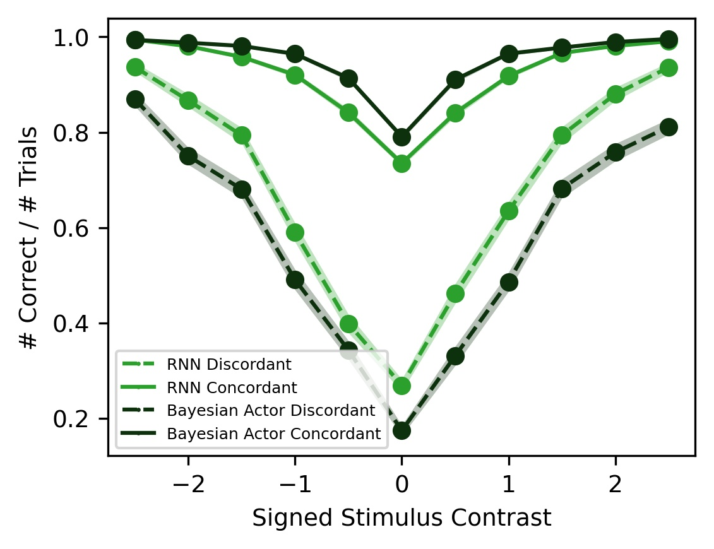
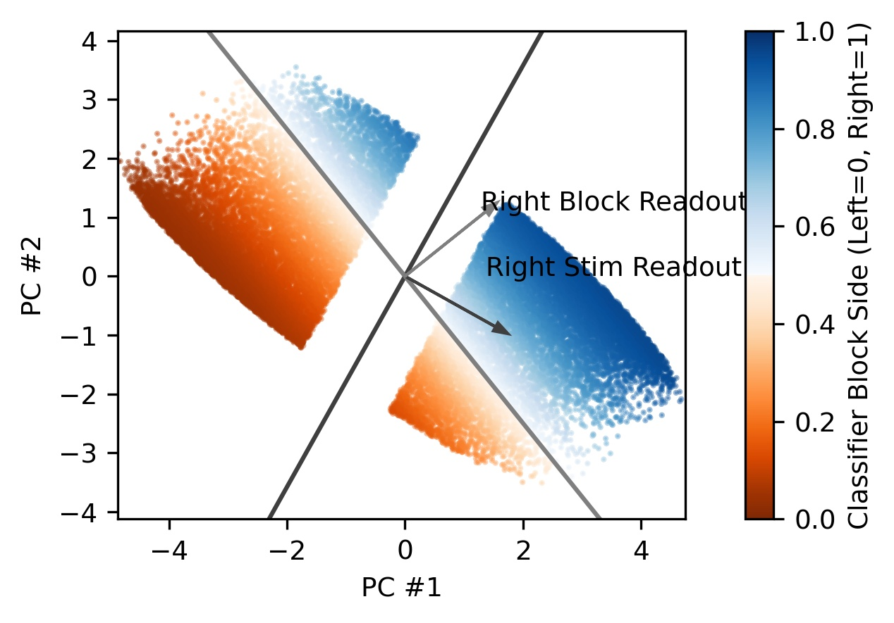
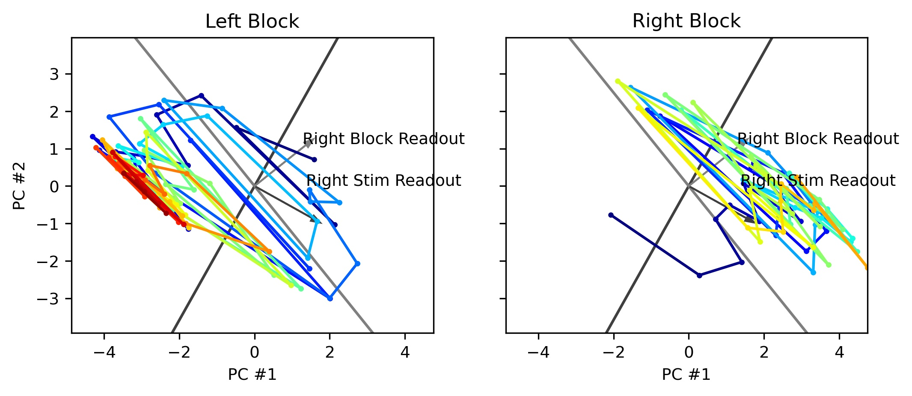
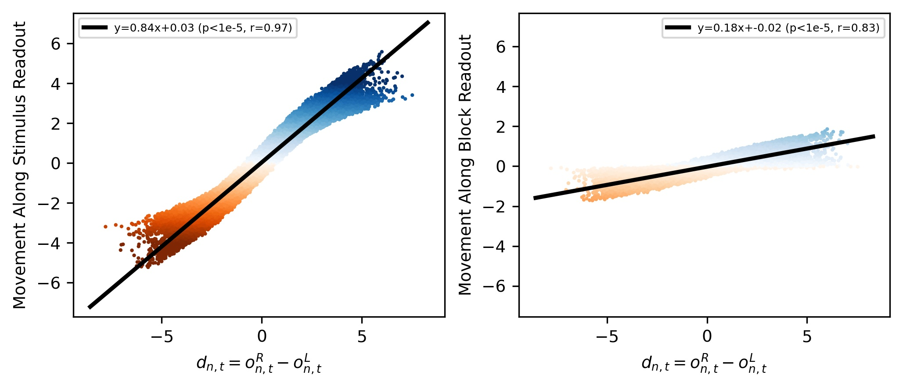
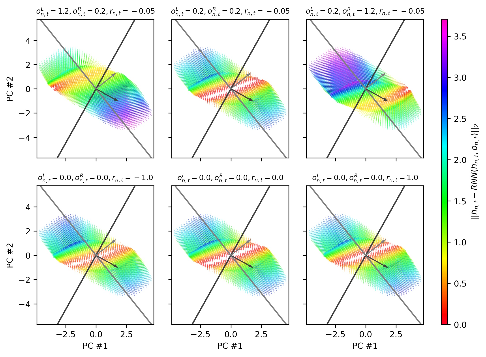
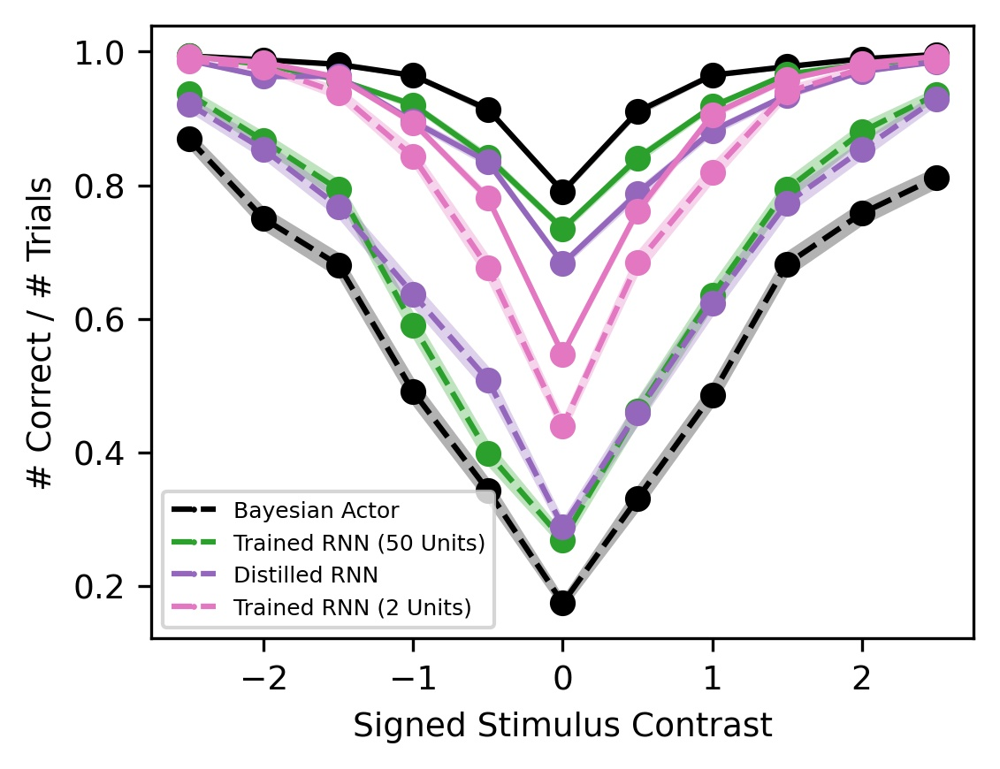

## Reverse-engineering recurrent neural network solutions to a hierarchical inference task for mice

### Authors:
- Rylan Schaeffer
- Mikail Khona
- Leenoy Meshulam
- Ila Rani Fiete

### Abstract

We study how recurrent neural networks (RNNs) solve a hierarchical inference task
involving two latent variables and disparate timescales separated by 1-2 orders
of magnitude. The task is of interest to the International Brain Laboratory, a
global collaboration of experimental and theoretical neuroscientists studying
how the mammalian brain generates behavior. We make four discoveries. First, 
RNNs learn behavior that is quantitatively similar to ideal Bayesian baselines.
Second, RNNs perform inference by learning a two-dimensional subspace defining
beliefs about the latent variables. Third, the geometry of RNN dynamics reflects 
an induced coupling between the two separate inference processes necessary to 
solve the task. Fourth, we perform model compression through a novel form of 
knowledge distillation on hidden representations  -- Representations and Dynamics 
Distillation (RADD)-- to reduce the RNN dynamics to a low-dimensional, highly 
interpretable model. This technique promises a useful tool for interpretability 
of high dimensional nonlinear dynamical systems. Altogether, this work yields 
predictions to guide exploration and analysis of mouse neural data and circuity.

### Tweeprint

How do recurrent neural networks perform inference, and how well do they approach
Bayes-optimality? To answer both these questions, we trained RNNs to perform a task
used by the [International Brain Laboratory](internationalbrainlab.com/) that
combines perceptual decision-making with hierarchical inference of two latent variables.

How does the IBL task work? On each _trial_, the mouse is shown a (low or medium contrast) stimulus in its left 
or right visual fields and must indicate on which side it perceived the stimulus. Upon 
choosing the correct side, it receives a small reward.

Over a number of consecutive 
trials (a _block_), the stimulus has a higher probability of appearing on one side 
(left stimulus probability $$p_s$$, right stimulus probability $$1-p_s$$). In the next
block, the stimulus side probabilities switch. The change-points between blocks are not
signaled to the mouse. For a more detailed description, check out the 
[IBL behavioral preprint](https://www.biorxiv.org/content/10.1101/2020.01.17.909838v2).

We train RNNs on a slightly modified version of this task. For comparison, we
include two baselines, which we term the Bayesian _actor_ and the Bayesian _observer_.
The Bayesian actor tells us what ideal performance on the task is, and the 
Bayesian observer tells us how well the RNN could do given the actions it selects.

#### Claim 1: RNNs approach Bayes-optimal behavior

Looking at behavior first, we found that RNNs approach both Bayesian baselines. 
When the stimulus contrast
is high, the RNN selects the correct action overwhelmingly, and when the stimulus
contrast is low, the RNN uses the block prior to guess at above-chance levels.

Breaking down trials between concordant (stimulus side = block side) and discordant
(stimulus side = -block side), we see that both the RNN and the Bayesian Actor select 
the correct action more on concordant trials and that the gap is greater for low-contrast
trials than high-contrast trials. This shows that when the contrast strength is low, 
the prior dominates the likelihood, while at high contrasts, the likelihood dominates
the prior.

We next asked what representations the RNN learns to perform this inference.
We find that the RNN learns a 2D representation of the stimulus side and block side
and that these two directions are non-orthogonal (which becomes important later!).

Trajectories in the PCA plane suggest that the RNN integrates evidence across many trials
along the block direction. Color here represents trial within the block (blue=early,
red=late). 

 

To quantify this, we first measured the instantaneous effect of an observation along
both the stimulus direction and the block direction. Both slopes are positive
(0.84 stimulus, 0.18 block, p<1e-5), confirming that perceptual evidence has
an instantaneous effect along both the stimulus direction and the block direction.

 

We then find that these instantaneous effects are integrated over multiple RNN steps.
Up to an arbitrary scaling parameter, we find that the magnitude of the RNN's activity
along the block direction very closely matches the Bayes-optimal block posterior
averaged over all trials.

However, on a trial-by-trial basis, we see a difference: the RNN's block side belief
fluctuates far more than the Bayesian baselines.

These fluctuations are driven by
within-trial evidence: single right- (left-) sided trials move the RNN's block belief
to the right (left) more strongly than they move the Bayesian observer's block
posterior.

This discrepancy is due to an induced dynamical coupling in the RNN between stimulus
and block inference. Specifically, the RNN must update its block and stimulus beliefs
simultaneously at each step and therefore cannot decouple the two inference problems,
whereas both baselines decouple the two inference problems by controlling _when_ 
information is communicated.

#### Claim 4: 

Finally, we asked what circuit mechanisms give rise to these representations and dynamics.
Ordering the hidden units using hierarchical clustering with Pearson correlation
revealed two subpopulations. Applying the same ordering to the recurrent weight matrix
revealed self-excitation, mutual inhibition for the two subpopulations, which 
is strongly reminiscent of circuits in the brain capable of producing 1D line-attractor
dynamics or bistable attractor dynamics, depending on the strength of the recurrent
connections.

Visualizing the RNN vector fields shows that when the stimulus is strong, the network
exhibits one of two attractors, in the right-block right-stimulus quadrant or in the
left-block left-stimulus quadrant. When the stimulus is absent and there is no feedback,
the network exhibits a 1D line attractor, aligned with the block direction, to enable
the RNN to preserve its block side belief across trials. The line attractor has a 
small projection along the stimulus direction, which translates the block belief into a 
stimulus prior for the next trial. 

To recover a quantitative description of the circuit, we propose a variation of 
knowledge distillation in which we train a small RNN to reproduce the hidden states
of the original RNN. This differs from conventional distillation in which the small
network is trained on the _output probabilities_ or _logits_ of the original model
We call our approach {\em Representation and Dynamics Distillation} (RADD).
We find that a 2-unit distilled RNN almost perfect preserves distance in the original
RNN and qualitatively reproduces the same state space trajectories.

Depending on the magnitude of the distilled RNN's readout vector (a free parameter),
the distilled system can outperform the full RNN (distilled 86.87%, full 85.50%).
The distilled 2-unit RNN recognizes blocks in the same way as the original RNN,
whereas a 2-unit RNN trained directly on the task itself fails to recognize blocks
after four times as many gradient steps.

Coolest of all, the distilled model has easily interpretable, highly sensible
parameters! The input weights show that observations drive the stimulus and
block side beliefs in a common direction, but that the movement caused by a
single observation is 5x along the stimulus direction than the block direction.
Additionally, the block belief is longer lasting than the stimulus belief,
and the block belief has more of an effect on the stimulus belief than the block
belief, consistent with the structure of the task!

