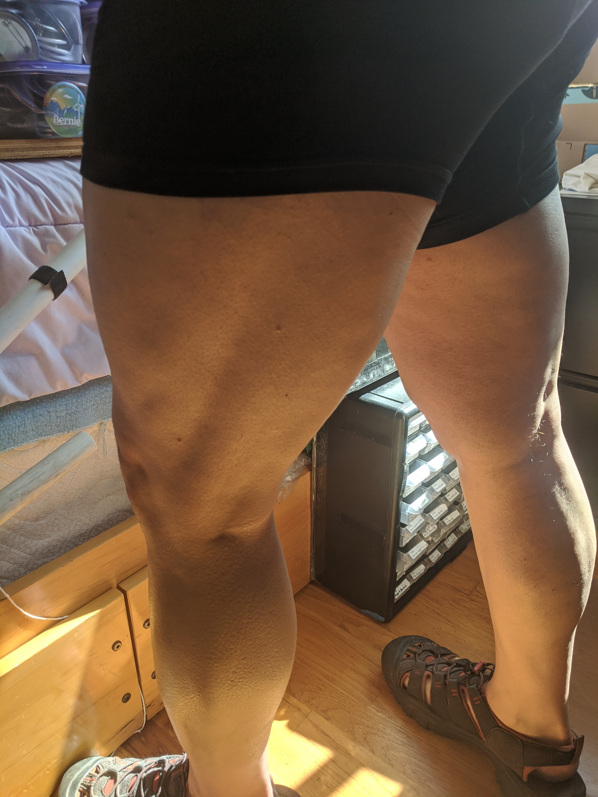

# The Idea Machine
## Learning at Harvard and MIT in the Age of Artificial Intelligence

### Background

One of my favorite books is <a href="https://mitpress.mit.edu/books/idea-factory">
The Idea Factory: Learning to Think at MIT</a> by Pepper White. It tells Pepper's story
as a student earning his Master's in Mechanical Engineering at MIT in the 1980s,
capturing his research, experiences and feelings of inadequacy first-hand. Forty years
later, as a Master's student at Harvard conducting research in MIT's Brain and Cognitive
Science Department, these posts are my stories, inspired by Pepper and in tribute to
those who came before. To paraphrase my favorite quote, "If I could see \[...\] an insight,
a new way of looking at it that would maybe, just maybe, find its way into future generations
\[...\] In the Eiffel tower of technology, I would be a rivet."

### Coronavirus Career Development

My parents and I have often discussed the two of them trying to become more familiar with
quantitative topics. This past term, I was a teaching fellow for 
[Harvard's Data Science 10](https://github.com/stat10), and since I'm back at 
home due to Coronavirus, I proposed that I could teach them using the lectures, 
jupyter notebooks and assignments. They both agreed and since then we've had an absolute
blast. The two of them have complementary strengths, with my father having an edge at 
coding and my mother having an edge with algebra.

 

I was expecting teaching the two of them to be relatively uneventful, but fortuitiously,
we've made so many enjoyable memories. 

### Hosting Trivia

### Dad's Legs

This one is a bit gnarly, but honestly, I can't not talk about this. My father 
cycles for 90 minutes five nights a week, consistently, and I finally noticed
legs. I made him stand in the light where I could capture the following photos.

That gastrocnemius looks fake.