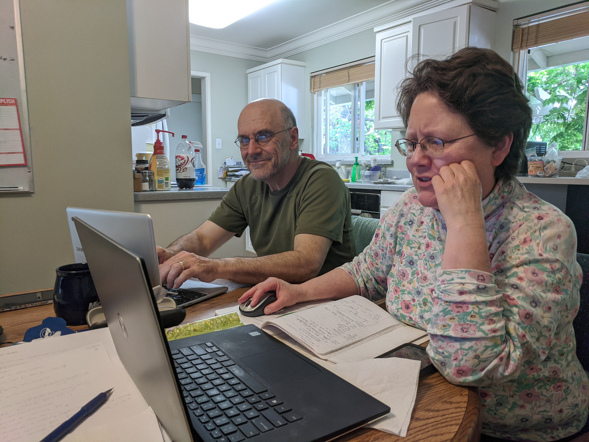
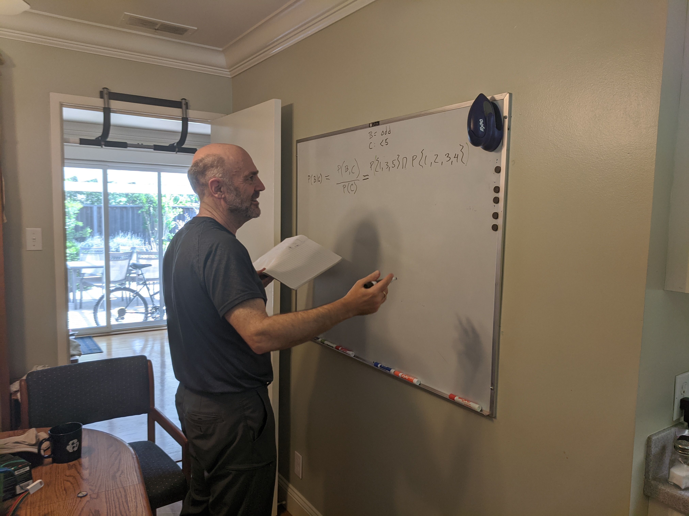
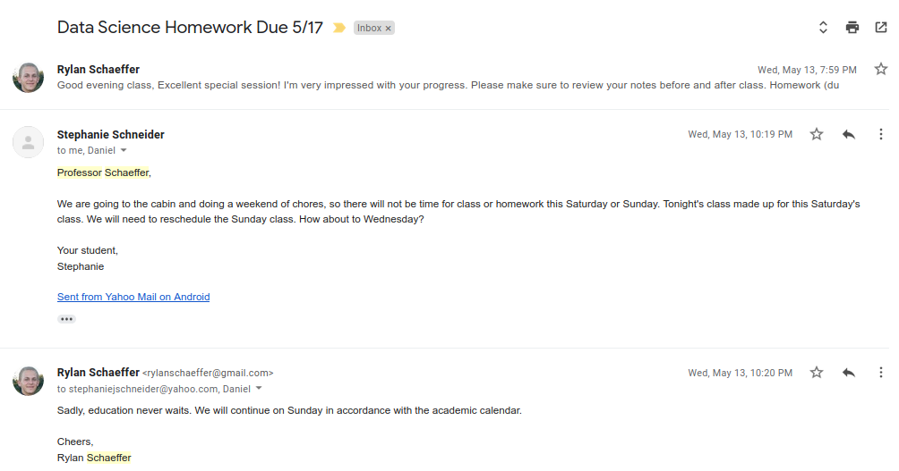
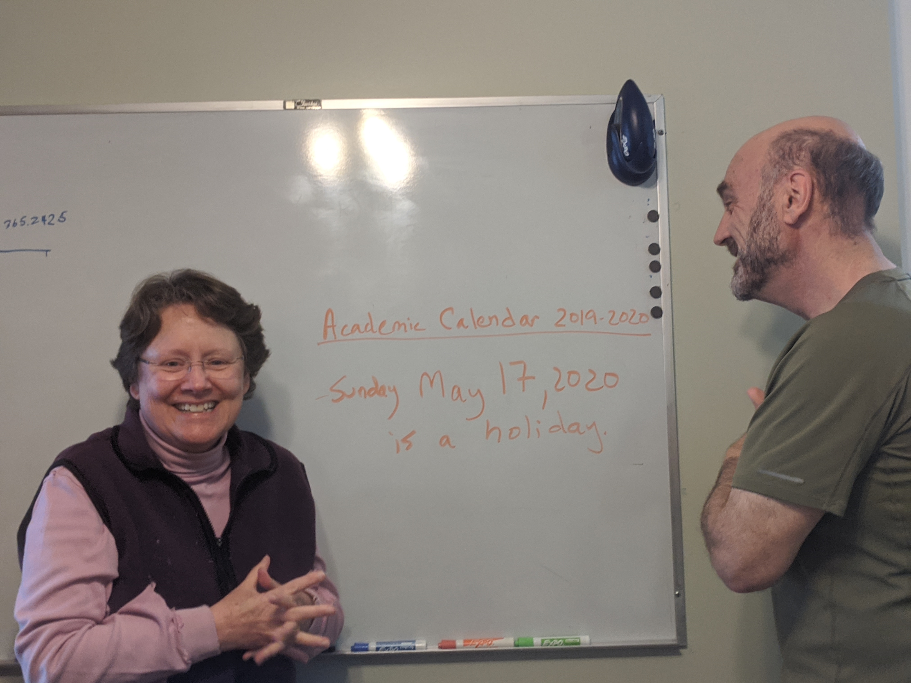
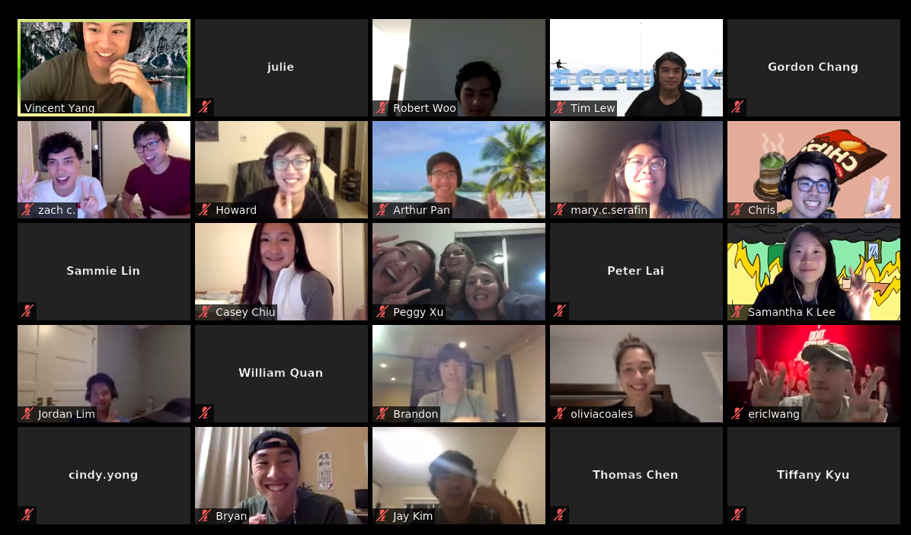
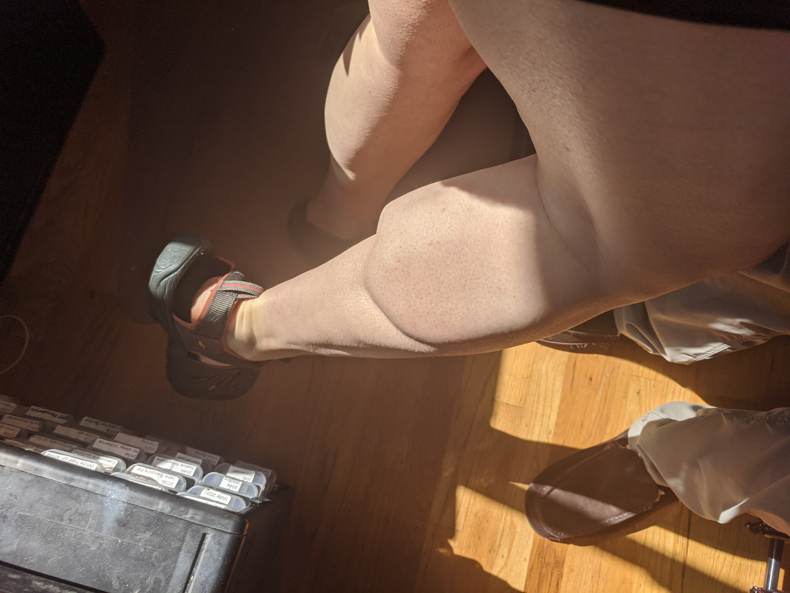

# The Idea Machine
## Learning at Harvard and MIT in the Age of Artificial Intelligence

### Background

One of my favorite books is <a href="https://mitpress.mit.edu/books/idea-factory">
The Idea Factory: Learning to Think at MIT</a> by Pepper White. It tells Pepper's story
as a student earning his Master's in Mechanical Engineering at MIT in the 1980s,
capturing his research, experiences and feelings of inadequacy first-hand. Forty years
later, as a Master's student at Harvard conducting research in MIT's Brain and Cognitive
Science Department, these posts are my stories, inspired by Pepper and in tribute to
those who came before. To paraphrase my favorite quote, "If I could see \[...\] an insight,
a new way of looking at it that would maybe, just maybe, find its way into future generations
\[...\] In the Eiffel tower of technology, I would be a rivet."

### Coronavirus Career Development

My parents and I have often discussed the two of them trying to become more familiar with
quantitative topics. This past term, I was a teaching fellow for 
[Harvard's Data Science 10](https://github.com/stat10), and since I'm back at 
home due to Coronavirus, I proposed that I could teach them using the lectures, 
jupyter notebooks and assignments. They both agreed and since then we've had an absolute
blast. The two of them have complementary strengths, with my father having an edge at 
coding and my mother having an edge with algebra.

 

I was expecting teaching the two of them to be relatively uneventful, but fortuitiously,
we've made so many enjoyable memories. During one lecture, my father fell asleep.
My mother and I couldn't believe it. Most of the time, he's a very good student.
Here he is, teaching at the board.

During another lecture, I was teaching conditional probability and introduce them
to the formula:

$$P(A|B) = \frac{P(A, B)}{P(B)}$$

I then gave them a practice problem and five minutes to solve it. Halfway through, my
mother exclaimed "I've been using the wrong formula!" Here she is laughing at her
mistake.

My favorite story concerns our cabin. We're legally required to remove the flammable
debris surrounding it, so once a year, we typically head up where we rake and burn
the pine needles. However, this year was going to need extra work. The winter had 
been dry, and had been followed by a heavy snowstorm that wrecked havoc on the
weakened trees; three trees had fallen on our cabin. My mother sent me the following
email, asking for a break from our lectures to take care of the cabin.

 

She then showed up in my office and told me that I was misreading the academic
calendar. I asked, "How's that?" She then wrote the following on the whiteboard.

One of my friends, V, has already agreed to be a guest lecturer. If you're
interested in joining us or doing something similar with your family, get in
touch!

### Hosting Trivia

### Dad's Legs

This one is a bit gnarly, but honestly, I can't not talk about this. My father 
cycles for 90 minutes five nights a week, consistently, and I finally noticed
legs. I made him stand in the light where I could capture the following photos.

I showed some friends. One said "That gastrocnemius looks fake." and another said
"How come your dad is sportier than all my friends in my age."